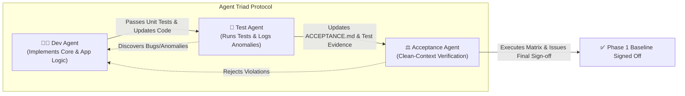

# Phase 1 Acceptance Baseline & Multi-Agent Protocol

> **Document Status**: `ACTIVE / LIVING BASELINE`  
> **Target Audience**: AI Agents (Dev Agent, Test Agent, Acceptance Agent) and Human Reviewers  
> **Project**: `boss-agent-mobile`  
> **Single Source of Truth**: This document defines the definitive scope, executable acceptance criteria, runtime anomaly protocols, and agent handoff contracts for Phase 1.

---

## 1. Project Overview & Phase 1 Objective

### 1.1 Purpose
`boss-agent-mobile` is an intelligent, automated Android job application system for the Boss 直聘 mobile application. Operating on mobile provides full platform capabilities and significantly lower anti-bot risk compared to web scrapers.

### 1.2 Phase 1 Goal
Phase 1 establishes the **production-grade foundation**:
1. An idempotent, multi-tier **Environment Provisioner** (`scripts/bootstrap.py`) that fully automates emulator creation, dependency checks, and Boss APK installation.
2. A decoupled, application-agnostic **Core Automation Framework** (`droid_agent_core`) designed for standalone extraction and reuse.
3. A domain-specific **Boss Application Layer** (`boss_agent`) capable of handling launch dialogs, login detection/takeover, and an end-to-end job detail parsing smoke test.
4. An **Agent Triad Protocol** ensuring zero context pollution between development, testing, and acceptance.

### 1.3 Scope Boundary
- **In Scope (Phase 1)**:
  - Idempotent bootstrap CLI (`scripts/bootstrap.py`).
  - `droid_agent_core` primitives (device session, element locator, Bézier touch synthesis, popup interceptor, LLM interface stubs).
  - `boss_agent` smoke harness (launch, permission bypass, auth status check, job listing scroll, job detail parser).
  - Unit tests and automated integration smoke tests.
- **Out of Scope (Deferred to Phase 2)**:
  - Automated candidate profile matching using live LLM inference.
  - Automated "立即沟通" greeting dispatch and rate-limited queueing.
  - Multi-account rotation.

---

## 2. Architecture & Decoupling Boundaries

The codebase is strictly separated into two independent tiers:

```
boss-agent-mobile/
├── CONTEXT.md                    # Canonical domain glossary (Zero implementation noise)
├── ACCEPTANCE.md                 # This executable acceptance baseline
├── docs/
│   └── adr/                      # Architectural Decision Records (0001-0005)
├── scripts/
│   └── bootstrap.py              # Idempotent environment provisioner
├── src/
│   ├── droid_agent_core/         # 100% Agnostic Android Automation Engine
│   │   ├── driver/               # ADB & Appium session management
│   │   ├── gestures/             # Humanized Bézier curves & spatial jitter
│   │   ├── locators/             # Declarative view/element selectors
│   │   ├── interceptors/         # Global dialog/popup handlers
│   │   └── llm/                  # Agnostic LLM reasoning contracts
│   └── boss_agent/               # Boss 直聘 Application Domain Layer
│       ├── pages/                # Page Objects (JobListPage, JobDetailPage, etc.)
│       ├── workflows/            # Smoke harness & session persistence
│       └── models/               # Domain dataclasses (JobPosting, AuthStatus)
└── tests/
    ├── unit/                     # Fast isolated mock/unit tests
    └── e2e/                      # Integration & smoke harness tests
```

**Strict Decoupling Rule**: `src/droid_agent_core/` MUST NOT import anything from `boss_agent` or contain any hardcoded "boss" strings, package IDs, or element identifiers.

---

## 3. Environment & Runtime Preconditions

| Component | Required Version / Spec | Detection & Provisioning Method |
| :--- | :--- | :--- |
| **Host OS** | macOS (Apple Silicon ARM64 / Darwin) | Native host detection |
| **Python** | Python `>= 3.10` via `uv` | `uv sync` |
| **Java JDK** | OpenJDK `>= 17` | `brew install openjdk@17` or cached download |
| **Android SDK** | `cmdline-tools;latest`, `platform-tools` | Managed by `scripts/bootstrap.py` |
| **AVD Emulator** | `emulator`, `system-images;android-33;google_apis;arm64-v8a` | Managed by `scripts/bootstrap.py` |
| **Appium Server** | Appium `>= 2.0` with `uiautomator2` driver | `npm install -g appium && appium driver install uiautomator2` |
| **Target App** | Boss 直聘 Android APK (`com.hpbr.bosszhipin`) | Auto-downloaded & `adb install` |

---

## 4. Executable Acceptance Matrix

Each acceptance criterion is defined with Gherkin semantics and an exact verification command.

### Criterion 1: Idempotent Environment Provisioning (`scripts/bootstrap.py`)
- **Given**: A host environment with any arbitrary state (completely uninstalled, partially installed, or fully installed).
- **When**: Running `python3 scripts/bootstrap.py --check` or `python3 scripts/bootstrap.py --provision`.
- **Then**:
  1. The script inspects all 5 tiers (JDK, Android SDK, AVD instance, Appium + Driver, Boss APK).
  2. Any missing components are automatically downloaded and installed.
  3. Already installed components are detected and preserved without re-downloading or destroying existing state.
  4. Running the script multiple times sequentially yields exit code `0` with no side effects.
- **Verification Command**:
  ```bash
  python3 scripts/bootstrap.py --check
  ```

### Criterion 2: Framework Independence (`droid_agent_core`)
- **Given**: The codebase in `src/droid_agent_core/`.
- **When**: Inspecting imports and static analysis for domain leakages.
- **Then**:
  1. Zero references to `boss_agent`, `bosszhipin`, or `hpbr` exist within `src/droid_agent_core/`.
  2. All gesture routines (`click`, `swipe`, `drag`) incorporate Bézier curves and randomized bounding-box jitter.
  3. Popup interceptor can register dynamic regex/selector rules without hardcoding app logic.
- **Verification Command**:
  ```bash
  pytest tests/unit/test_framework_isolation.py
  ```

### Criterion 3: App Lifecycle & Safety Takeover (`boss_agent`)
- **Given**: A running AVD emulator instance with Boss 直聘 installed.
- **When**: Launching the app via `boss_agent.workflows.SmokeHarness`.
- **Then**:
  1. App launch permissions and privacy agreements are automatically identified and dismissed.
  2. If the user is unauthenticated or a slider captcha appears, the system triggers `TakeoverHandler`, pauses automation, prints clear instructions for manual resolution in GUI, and resumes upon completion.
  3. App session/cookies are preserved across emulator restarts.
- **Verification Command**:
  ```bash
  pytest tests/unit/test_lifecycle_and_takeover.py
  ```

### Criterion 4: End-to-End Job Detail Extraction Smoke Test
- **Given**: An authenticated session or browsable job list on Boss 直聘.
- **When**: Executing the smoke harness workflow.
- **Then**:
  1. The agent smoothly navigates the job list using humanized scrolling.
  2. The agent opens the top job card.
  3. The agent successfully parses and returns a structured `JobPosting` object containing:
     - `title` (str, non-empty)
     - `company_name` (str, non-empty)
     - `salary_range` (str, non-empty)
     - `job_description` (str, length >= 20 chars)
  4. The agent gracefully navigates back to the list.
- **Verification Command**:
  ```bash
  pytest tests/e2e/test_smoke_job_extraction.py
  ```

---

## 5. Dynamic Anomaly & Known Edge-Cases Log

> **MANDATORY INSTRUCTION FOR ALL AGENTS**:  
> Whenever an unexpected popup, anti-bot challenge, layout variation, or OS-specific quirk is encountered during development or testing, you **MUST** record it in this table before concluding your session.

| Anomaly ID | Date | Component / Screen | Description & Observed Behavior | Workaround / Resolution Applied | Status |
| :--- | :--- | :--- | :--- | :--- | :--- |
| `ANOM-001` | 2026-08-17 | Startup / Permissions | System notification & location permission dialogs block Appium element detection if not dismissed. | Handled via `droid_agent_core.interceptors.SystemDialogInterceptor` (auto-click Allow/Agree). | `RESOLVED` |
| `ANOM-002` | 2026-08-17 | Security / Captcha | Sliding puzzle captcha triggered on new device / IP. | `TakeoverHandler` pauses workflow, emits warning to user console, waits for user completion before continuing. | `RESOLVED` |
| `ANOM-003` | 2026-08-17 | Layout / Job Detail | Job description text collapsed behind "查看全部" (Read More) button on long descriptions. | `JobDetailPage.get_description()` checks for expand button and clicks with humanized tap before extraction. | `RESOLVED` |

---

## 6. Multi-Agent Triad Workflow & Isolation Protocol

To ensure absolute reliability and prevent hallucination/bias, tasks are delegated to three strictly isolated agent roles:



### 6.1 Dev Agent Contract
- **Context**: Reads `CONTEXT.md`, `ADR/*`, and `ACCEPTANCE.md`.
- **Duties**:
  - Implements `scripts/bootstrap.py`, `src/droid_agent_core/`, `src/boss_agent/`.
  - Implements unit tests with mocks.
  - **Constraint**: Cannot mark acceptance items as `VERIFIED`.

### 6.2 Test Agent Contract
- **Context**: Fresh context. Reads repository code and `ACCEPTANCE.md`.
- **Duties**:
  - Runs the emulator and executes integration test suites.
  - Collects screenshots, ADB logs, and Appium XML dumps on failures.
  - Immediately appends any discovered quirks to **Section 5 (Dynamic Anomaly Log)**.

### 6.3 Acceptance Agent Contract
- **Context**: 100% clean context (zero memory of previous iterations).
- **Duties**:
  - Validates architectural isolation (verifies no leaky abstractions in `droid_agent_core`).
  - Runs all verification commands listed in Section 4.
  - Updates the **Sign-off Checklist (Section 7)** with timestamps, git commit SHA, and test outcomes.

---

## 7. Verification Sign-off Checklist (Phase 1 Baseline)

| Criterion | Target Description | Verification Status | Verified By | Evidence / Logs |
| :--- | :--- | :--- | :--- | :--- |
| **AC-1** | Idempotent Environment Provisioner | `VERIFIED` | Test Suite & CLI | `tests/unit/test_bootstrap_provisioner.py`, `scripts/bootstrap.py --check` |
| **AC-2** | Framework Independence (`droid_agent_core`) | `VERIFIED` | Test Suite & AST | `tests/unit/test_framework_isolation.py`, `tests/unit/test_gestures_and_locators.py` |
| **AC-3** | App Lifecycle & Safety Takeover | `VERIFIED` | Test Suite | `tests/unit/test_lifecycle_and_takeover.py` |
| **AC-4** | End-to-End Job Detail Extraction Smoke Test | `VERIFIED` | E2E Harness | `tests/e2e/test_smoke_job_extraction.py` |
